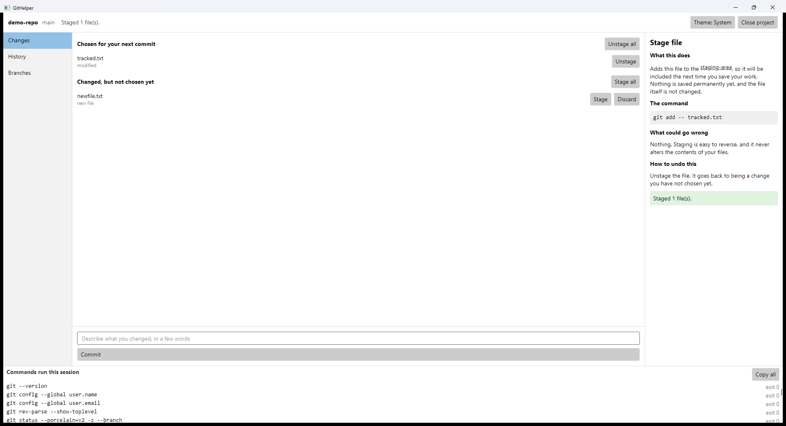

# GitHelper

**A desktop git client for people who don't know git yet.**

Every action explains what it will do — in plain English — *before* it runs, shows the exact
`git` command it is about to execute, warns about consequences in concrete terms, and tells you
how to undo it afterwards.

It works on your **real repositories**, not a simulator. You learn on your own work, with
guardrails.



---

## Why this exists

Every git GUI assumes you already understand git. They give you buttons labelled `fetch`,
`rebase`, and `HEAD~1`, and quietly assume you know what those mean and what they'll cost you.

Beginners don't learn git from those tools. They learn a sequence of clicks that seems to work,
and then panic the first time it doesn't.

GitHelper takes the opposite approach: it explains at **the moment of decision**, which is when
an explanation actually sticks. And it has a deliberate second goal — that you eventually stop
needing it. The real command is always on screen, and every command the app runs accumulates in
a log strip you can copy and paste into a terminal.

The app is meant to make itself obsolete.

## How it works

Every action follows the same three beats:

### 1. Explain — nothing has run yet

The panel always shows four headings, always in the same order, so the structure becomes
predictable instead of something you have to re-read:

| Heading | What it gives you |
|---|---|
| **What this does** | Plain English. Jargon isn't avoided — it's underlined, with the definition on hover, so you still learn the vocabulary. |
| **The command** | The exact `git` invocation, copyable. |
| **What could go wrong** | Concrete consequences, not generic warnings. |
| **How to undo this** | Every action, including the ones that can't be undone — which say so. |

### 2. Confirm — gated by how dangerous the action actually is

| Danger | Gate |
|---|---|
| **Safe** | Runs immediately, explanation shown alongside. |
| **Caution** | Inline confirmation button. |
| **Destructive** | A **modal dialog** — deliberately in a different screen position and weight, so it can't be dismissed by the muscle memory you build clicking inline buttons. Its consequence sentence names the real file. |

There's a per-action **"stop explaining this one"** toggle, because a tool that nags gets
reflex-clicked past, which defeats the whole point. Destructive confirmations are never
suppressible.

### 3. Narrate — what actually happened

The app snapshots repository state before and after, then reports the **observed** difference
rather than the intended one:

> Created commit `a1b2c3d` with 3 files. `main` is now 1 commit ahead of `origin/main`.

This matters: narrating what actually happened means the app can't confidently claim success
when git did something unexpected.

## Features

- **Three-pane shell** — file/history/branch lists, the explain panel, and a permanent command log.
- **A command log that teaches the CLI** — every `git` invocation the app makes, with exit codes, in pasteable form. Multi-word arguments come out correctly quoted.
- **Plain-English error translation** — with the raw git output always one click away, never hidden.
- **Live refresh** — edit a file outside the app and the Changes tab updates within about a second, debounced so a burst of writes causes one refresh, not fifty.
- **A glossary built into the prose** — hover any underlined term for its definition.
- **Recent projects, light/dark/system theme**, and your per-action preferences, all persisted.
- **Identity setup** — if `user.name` / `user.email` aren't configured, the app offers to set them, rather than letting your first commit fail with a wall of git configuration advice.
- **Refuses to pretend** — if git isn't installed, it says so plainly instead of failing mysteriously later.

## The action set

Thirteen actions, covering roughly the 90% of beginner git that doesn't involve conflicts.

| Action | Command | Danger |
|---|---|---|
| Stage file | `git add -- <path>` | Safe |
| Unstage file | `git restore --staged -- <path>` | Safe |
| Stage all | `git add -A` | Safe |
| Unstage all | `git restore --staged -- .` | Safe |
| Commit | `git commit -m <message>` | Caution |
| Create branch | `git switch -c <name>` | Safe |
| Switch branch | `git switch <name>` | Caution |
| Check for updates | `git fetch` | Safe |
| Get changes | `git pull --ff-only` | Caution |
| Send changes | `git push` | Caution |
| Discard file | `git restore -- <path>` | **Destructive** |
| Undo last commit | `git reset --soft HEAD~1` | Caution |
| Delete branch | `git branch -d <name>` | Caution |

Three choices in that table are teaching decisions, not technical ones:

- **`pull --ff-only`, never a plain `pull`.** A beginner should never get a merge commit they
  didn't ask for and can't explain. When it can't fast-forward, it refuses — and the refusal is
  explained.
- **`branch -d`, never `-D`.** The safe form refuses to delete a branch holding unmerged work.
  That refusal gets explained rather than overridden.
- **Creating a branch is Safe; switching to one is Caution.** Even though `switch -c` does both.
  Creating at the current HEAD carries your changes along and can't lose anything; switching to
  an *existing* branch can collide with uncommitted work. The danger levels reflect that real
  difference.

`discard-file` is the only Destructive action. That's the point: there are very few ways to lose
work.

## Architecture

```
GitHelper.Core      Git runner, parsers, action descriptors, safety rules,
                    error translation, content loader.  No Avalonia reference.
GitHelper.Content   Authored explanations and glossary, embedded as resources.
GitHelper.App       Avalonia UI. Views + viewmodels, MVVM via CommunityToolkit source generators.
```

`Core` having no UI dependency is the load-bearing constraint: the entire engine is testable
headlessly, and the UI could be replaced without touching any git or teaching logic.

**Actions are data, not code paths.** Each is a descriptor — id, argv builder, preconditions,
danger level, explanation id. Adding one later is a descriptor plus a content file: no new UI
code, no new branches in the flow.

**Explanations are hand-written content files, not generated at runtime.** Deterministic,
offline, no API key, no per-click latency or cost — and reviewable for correctness, which matters
a great deal when the thing you're doing is teaching.

### Some details worth calling out

- **Every git call goes through one choke point**, using `ProcessStartInfo.ArgumentList` — an argv
  array, never a joined string, never a shell. Quoting and injection defects can't occur.
- **stdout and stderr are read concurrently.** Reading them sequentially deadlocks once output
  exceeds a pipe buffer — the classic .NET failure here, designed out from the start.
- **`-c core.quotepath=false`** on every invocation, so non-ASCII filenames aren't mangled into
  octal escapes.
- **Status is parsed from `--porcelain=v2 -z`** with a record reader, not line splitting — the
  `-z` output is NUL-separated and rename records carry two paths in one record.
- **Git runs off the UI thread.** A slow `push` never freezes the window.

## Testing

**330 tests**, all headless.

Viewmodel and engine tests drive **real git** against throwaway repositories in the temp
directory — not mocks — so the parsers are tested against the git that's actually installed. View
tests render through Avalonia's headless platform, so no window appears and the suite runs
unchanged in CI.

```bash
dotnet test
```

## Getting started

**Requires** the .NET 10 SDK and `git` on your `PATH`.

```bash
dotnet run --project src/GitHelper.App/GitHelper.App.csproj
```

### Building a standalone executable

```bash
dotnet publish src/GitHelper.App/GitHelper.App.csproj -c Release -o publish
```

Produces a single self-contained `publish/GitHelper.App.exe` (~125 MB) with the .NET runtime
bundled — it runs on a Windows machine with no SDK installed. Git itself is not bundled: the app
drives the real `git` binary, and tells you plainly if it's missing.

## Deliberately not in v1

Recorded so they read as decisions rather than oversights:

- **Merge, rebase, stash, cherry-pick, and tags.**
- **Guided conflict resolution** — this is milestone 2. It's the scariest part of git for a
  beginner and the most complex UI in the product; it deserves its own design pass rather than
  being squeezed in.
- **Hunk-level staging** — staging is whole-file for now.
- **A diff viewer** — the Changes tab lists *what* changed, not the contents of the change.
- **Remote management and submodules.**

## Project layout

```
src/
  GitHelper.Core/       engine — git, parsing, actions, errors
  GitHelper.Content/    authored explanations + glossary (13 actions, 8 terms)
  GitHelper.App/        Avalonia UI
tests/
  GitHelper.Core.Tests/ engine tests against real git
  GitHelper.App.Tests/  viewmodel + headless view tests
  GitHelper.TestSupport/ throwaway-repo helpers
docs/
  running-githelper.md  build and run instructions
```

## Built with

.NET 10 · [Avalonia](https://avaloniaui.net/) 11.3 · [CommunityToolkit.Mvvm](https://learn.microsoft.com/dotnet/communitytoolkit/mvvm/) 8.4 · xUnit
